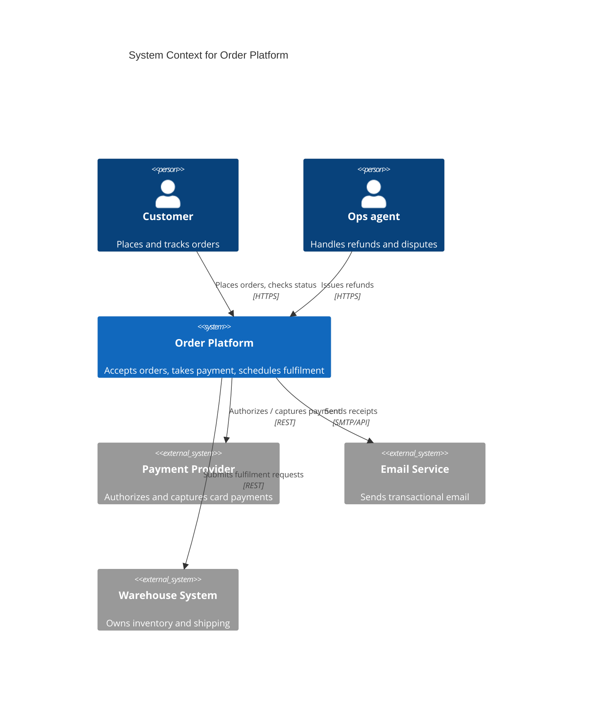

# Order platform — system context

How the order platform sits among its users and external dependencies. Scope: the
platform as a single black box; internals are out of scope (see a container
diagram for those).

