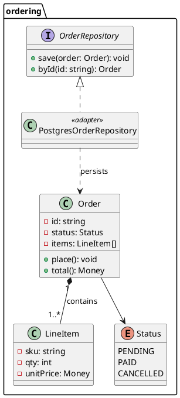

# Ordering domain — class model (PlantUML)

The domain types and their relationships, shown in PlantUML because it expresses
generics, stereotypes, and a port/adapter split more precisely than Mermaid.
This needs a PlantUML renderer (server or Confluence PlantUML macro) — it does
not render natively on GitHub.

