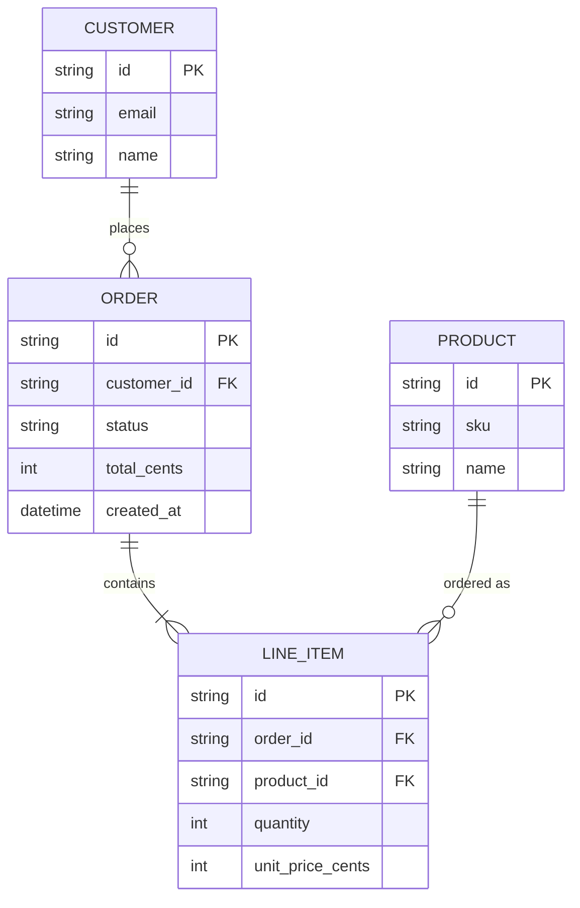

# Order platform — data model

The persisted entities behind ordering and their relationships. Scope: the
ordering aggregate; payment and fulfilment records are out of scope.

```mermaid
erDiagram
    CUSTOMER ||--o{ ORDER : places
    ORDER ||--|{ LINE_ITEM : contains
    PRODUCT ||--o{ LINE_ITEM : "ordered as"

    CUSTOMER {
        string id PK
        string email
        string name
    }
    ORDER {
        string id PK
        string customer_id FK
        string status
        int total_cents
        datetime created_at
    }
    LINE_ITEM {
        string id PK
        string order_id FK
        string product_id FK
        int quantity
        int unit_price_cents
    }
    PRODUCT {
        string id PK
        string sku
        string name
    }
```
