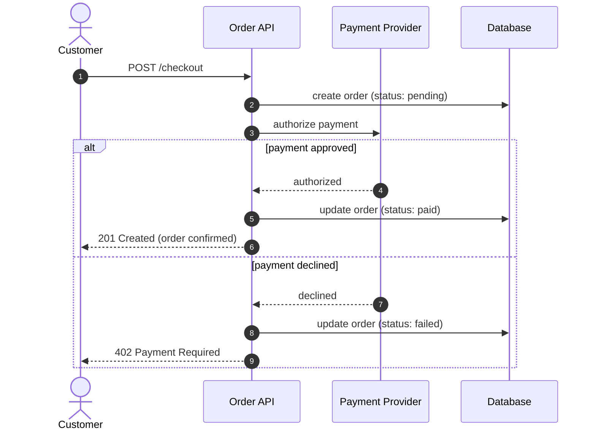

# Checkout — place an order

The order of messages when a customer submits checkout, from the API through
payment to confirmation. Scope: the happy path plus the payment-declined branch.

```mermaid
sequenceDiagram
    autonumber
    actor Customer
    participant API as Order API
    participant PSP as Payment Provider
    participant DB as Database

    Customer->>API: POST /checkout
    API->>DB: create order (status: pending)
    API->>PSP: authorize payment
    alt payment approved
        PSP-->>API: authorized
        API->>DB: update order (status: paid)
        API-->>Customer: 201 Created (order confirmed)
    else payment declined
        PSP-->>API: declined
        API->>DB: update order (status: failed)
        API-->>Customer: 402 Payment Required
    end
```
