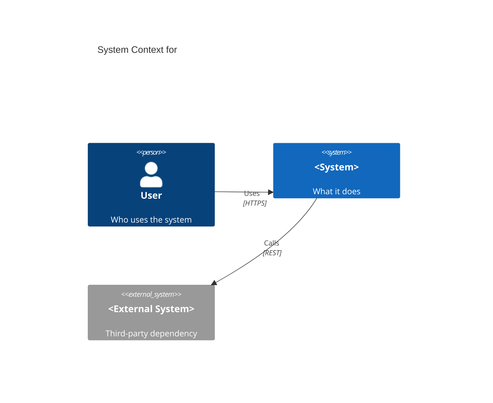
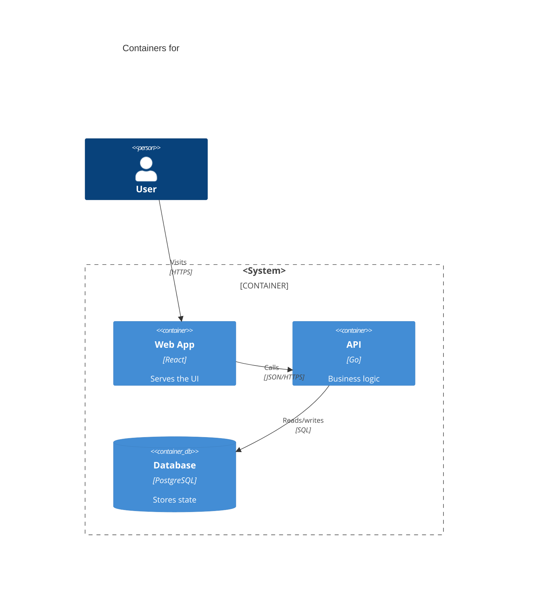
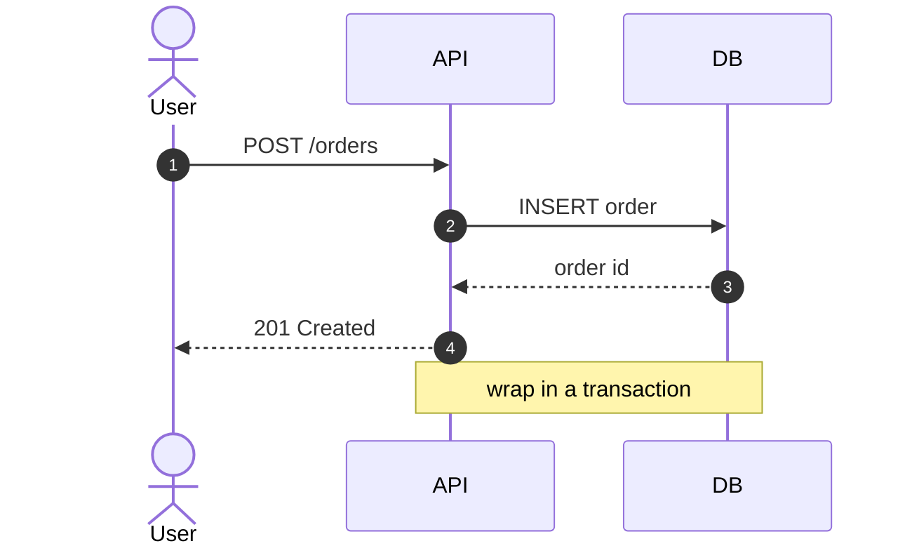
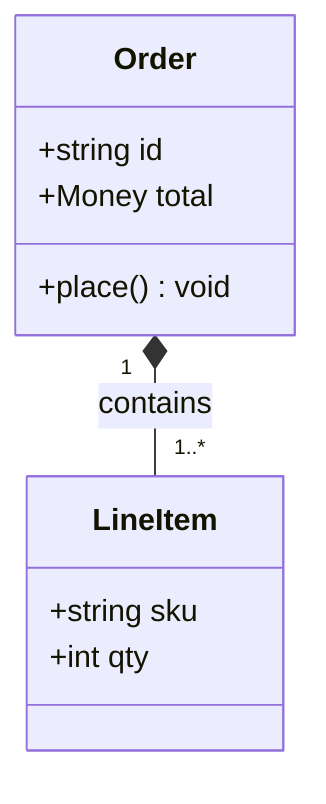
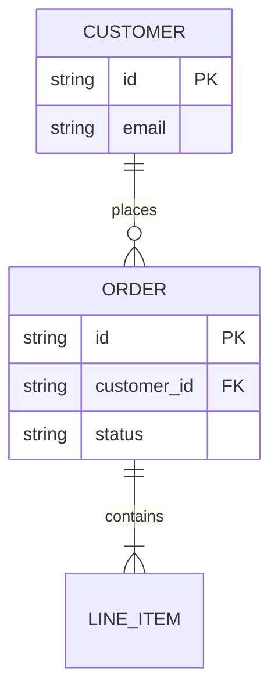
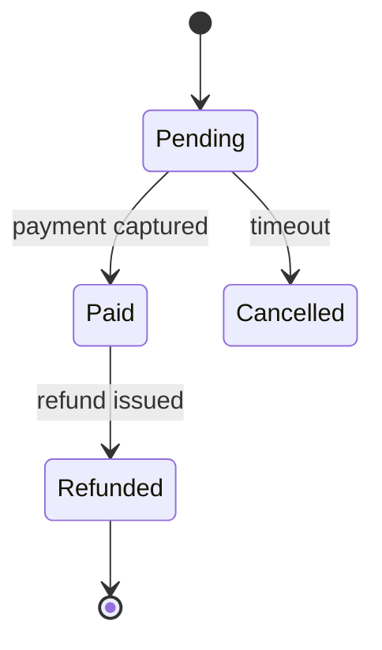
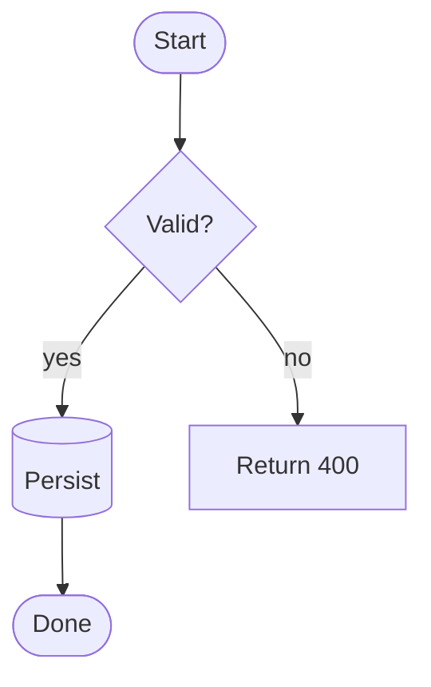
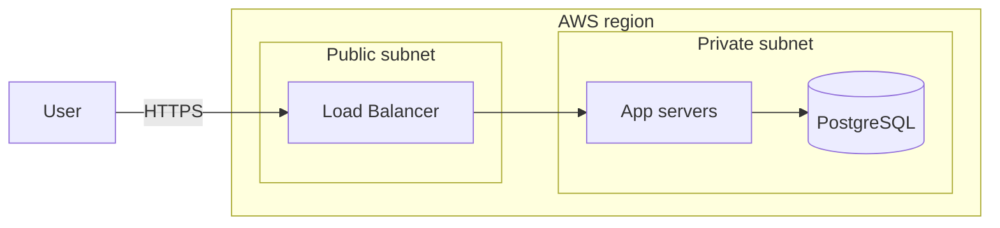
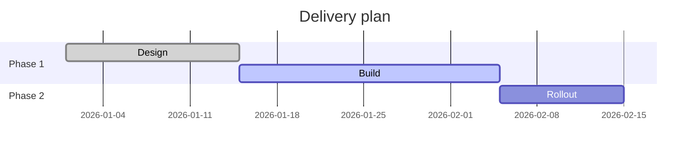
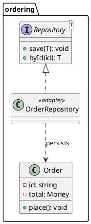

# Diagram notation reference

Minimal, render-correct skeletons for each diagram type. Copy the one that
matches the question, then replace the placeholders. Mermaid is the default;
the PlantUML variants are for the fallback cases noted in `SKILL.md`.

## Mermaid

### C4 Context — what systems and people exist and how they link



### C4 Container — what containers make up one system



### Sequence — what happens, in what order, between parties



### Class — types and their relationships



### Entity-relationship — what the persisted data looks like



### State machine — states a thing moves through



### Flowchart — process or decision logic



### Deployment — what runs where at runtime



### Roadmap — delivery timeline / phasing



## PlantUML (fallback)

Wrap every diagram in `@startuml` / `@enduml`. PlantUML needs a PlantUML
renderer (server or macro) — it does not render natively on GitHub.

### Class — rich UML (generics, stereotypes, visibility, packages)



### C4 component — detailed component view (C4-PlantUML)

```plantuml
@startuml
!include https://raw.githubusercontent.com/plantuml-stdlib/C4-PlantUML/master/C4_Component.puml

Container_Boundary(api, "API") {
  Component(handler, "Order Handler", "HTTP", "Validates and routes")
  Component(svc, "Order Service", "Domain", "Business rules")
  Component(repo, "Order Repository", "Adapter", "Persistence")
}
ContainerDb(db, "Database", "PostgreSQL")

Rel(handler, svc, "Calls")
Rel(svc, repo, "Uses")
Rel(repo, db, "Reads/writes", "SQL")
@enduml
```
